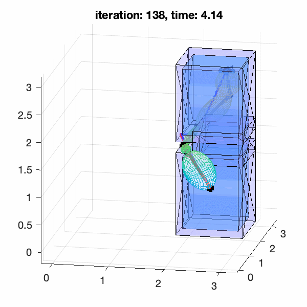
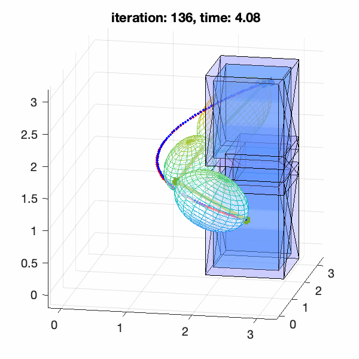
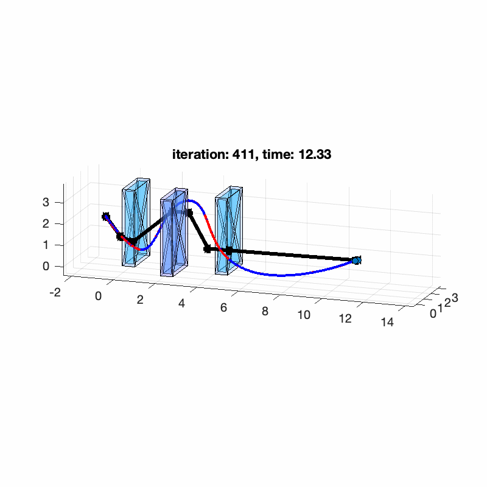
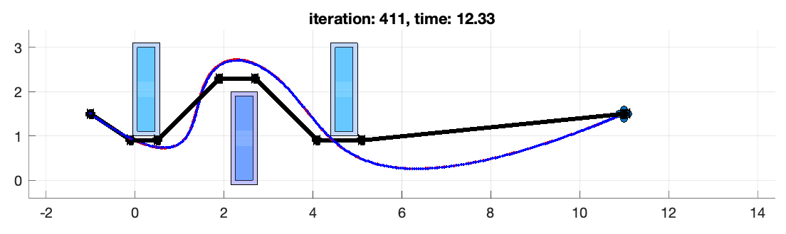
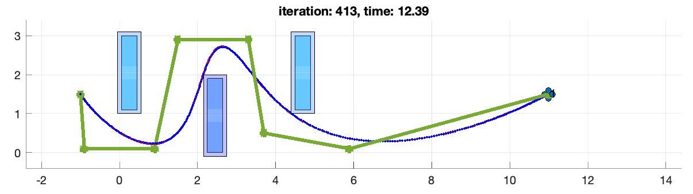

# Motion Planning

A new method to improve path planning


- Path planning algorithms (Jump point search,  JPS-PF )

- Generating Convex Polytopes(Safe Flight Corridors)

- Time Allocation(Average time allocation, Trapezoidal time allocation)

- Trajectory planning(QP)

- Trajectory following control(PD controller)


## Required

MATLAB(R2019b is tested)


## Demo

Run the demo map script (Only three maps have been released so far) ：

```
demo_3dCorner.m
demo_ellipsoid.m
demo_Z_3blocks.m
```


### Map: 3dCorner

- Same starting point and ending point

- same total planning time, use trapezoidal time allocation

| Method     | JPS                                                          | JPS-PF                                                       |
| ---------- | ------------------------------------------------------------ | ------------------------------------------------------------ |
| trajectory |  |  |
| SFC        |  |  |
| Avg_speed  | 0.8                                                          | 1.0767                                                       |
| Time       | 4.3681                                                       | 4.3681                                                       |
| miniSnap   | 895.7681                                                     | 350.3038                                                     |

 

### Map: Z_3blocks

| Method     | JPS                                                          | JPS-PF                                                       |
| ---------- | ------------------------------------------------------------ | ------------------------------------------------------------ |
| trajectory |  |  |
| Top view   |      |  |
| Avg_speed  | 1.10423                                                      | 1.4                                                          |
| Time       | 12.9343                                                      | 12.9343                                                      |
| miniSnap   | 300.3111                                                     | 58.376                                                       |


## Reference

##### Paper:

[1] D. Harabor and A. Grastien. 2011. "**Online Graph Pruning for Pathfinding on Grid Maps**". In Proceedings of the 25th National Conference on Artificial Intelligence (AAAI), San Francisco, USA.

[2] S. Liu, M. Watterson, K. Mohta, K. Sun, S. Bhattacharya, C.J. Taylor, et al., "**Planning dynamically feasible trajectories for quadrotors using safe flight corridors in 3-d complex environments**", IEEE Robotics and Automation Let- ters, vol. 2, no. 3, pp. 1688-1695, July 2017.

[3] D.W.Mellinger,"**Trajectory generation and control for quadrotors**"Ph.D. dissertation, Univ. Pennsylvania, Philadelphia, PA, 2012.

[4] D. Mellinger and V. Kumar, "**Minimum snap trajectory generation and control for quadrotors**", inProc. 2011 IEEE Int. Conf. Robot.Autom.,2011

[5] T. Lee, M. Leoky, and N. H. McClamroch, "**Geometric tracking control of a quadrotor UAV on SE (3)**" in *Proc. 49th IEEE Conf. Decis. Control*. IEEE, 2010, pp. 5420–5425.

